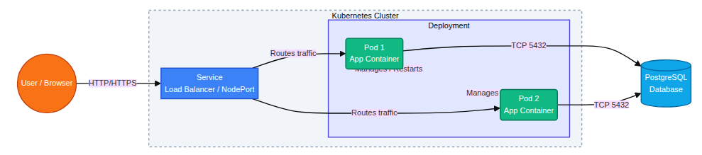

# 85 Architecture, Virtualization, and Production Design

## Map the current architecture

**Architecture Diagram**

**Where does isolation happen?**
L'isolation a lieu au niveau des conteneurs (via les namespaces et cgroups de Linux) à l'intérieur des Pods. Chaque Pod offre un environnement d'exécution isolé pour ses conteneurs, séparant les processus, le réseau, et les points de montage. Si des machines virtuelles sont utilisées comme nœuds Kubernetes, une isolation matérielle supplémentaire est fournie au niveau de chaque VM via l'hyperviseur.

**What restarts automatically?**
Les Pods sont redémarrés automatiquement par le contrôleur (comme le Deployment ou le ReplicaSet) s'ils échouent, s'ils plantent ou s'ils sont supprimés manuelllement ou par un problème hardware (si la machine s'éteint, un Pod de remplacement est recréé ailleurs). De plus, les conteneurs individuels à l'intérieur d'un Pod sont redémarrés automatiquement par l'agent `kubelet` en fonction de leur politique de redémarrage (restartPolicy, générallement always sur les Deployments).

**What does Kubernetes not manage?**
Kubernetes ne gère pas l'infrastructure matérielle physique sous-jacente (les serveurs bare-metal purs, le matériel réseau, le refroidissement datacenter), ni le système d'exploitation natif complet, et par défaut il ne gère pas le provisionnement dynamique de nouvelles machines virtuelles (bien qu'il s'interface avec les fournisseurs clouds pour le faire). Il ne gère pas non plus directement le code source, la génération et la phase de build des images Docker (nécessite une CI externe), ni la logique métier de l'application elle-même.

---

## Compare containers and virtual machines

**Comparaison entre Conteneurs et Machines Virtuelles**

| Caractéristique | Conteneur (ex: Docker) | Machine Virtuelle (ex: VMware, KVM) |
| --- | --- | --- |
| **Partage du noyau (Kernel)**| Partage le noyau du système d'hôte sous-jacent avec les autres conteneurs. | Possède son propre système d'exploitation invité (Guest OS) complet et son propre noyau. |
| **Temps de démarrage** | Très rapide (quelques millisecondes à secondes). | Plus lent (quelques secondes à minutes) en raison du temps de boot de l'OS complet. |
| **Surcharge de ressources** | Très faible overhead. Utilise essentiellement les ressources nécessaires pour le processus seulement. | Élevée. Un système d'exploitation entier doit tourner en arrière-plan, consommant une portion non négligeable de CPU, RAM et disque. |
| **Isolation de sécurité** | Isolation au niveau du processus de l'OS (Namespaces, cgroups). La sécurité n'est pas imperméable si une faille 'kernel escape' survient. | Isolation matérielle virtuelle très forte (Hyperviseur). Offre une bien meilleure sécurité multi-tenant. |
| **Complexité opérationnelle** | Exige très vite un ou des orchestrateurs massifs à configurer et maintenir (ex: Kubernetes) pour orchestrer l'état. | Architecture techniquement plus traditionnelle, plus aisée à concevoir au singulier et gérée via des hyperviseurs et outils d'infrastructure traditionnels. |

**When would you prefer a VM over a container?**
On préférera une VM lorsqu'une forte isolation de sécurité est indispensable (un cas typique : SaaS multitenance stricte avec des clients potentiellement non fiables qui partagent un hôte physique), lorsqu'on a besoin de faire tourner des logiciels exigeant un système d'exploitation différent de l'OS hôte (par ex: démarrer une application purement Windows sur un serveur data center Linux), ou pour des applications monolithiques lourdes et datées ("legacy apps") qui ne se décomposent pas en micro-services conteneurisables facilement.

**When would you combine both?**
Il est très courant, voire standard sur le web, de combiner les deux : faire tourner des clusters Kubernetes dont les nœuds ("nodes") sont des Machines Virtuelles.
Cette architecture permet de bénéficier de l'isolation de sécurité totale entre différents locataires sur les clouds publics à la couche IaaS (la VM) ; tout en appliquant sur cette infrastructure provisionnée la grande densité, portabilité, efficience et élasticité que procurent les conteneurs (via l'applicatif PaaS).

---

## Introduce horizontal scaling

**What changes when you scale?**
Le nombre total de Pods (réplicas applicatifs) exécutant l'image conteneurisée augmentera afin de répartir la charge. Le contrôleur (ReplicaSet) fera évoluer l'état "desiré", puis le cluster allouera des ressources pour faire apparaitre ces instances supplémentaires. En parallèle, l'utilisation globale des CPUs/RAMs du cluster augmentera également. Le composant `Service` détectera la création de ces nouveaux Endpoint (Pods) pour démarrer l'équilibrage du trafic entre chacun d'entre eux.

**What does not change?**
Le déploiement et la logique de l'application restent identiques. Les configurations de base de l'application, l'image Docker source, le point de contact global du `Service` interne et l'accès depuis l'extérieur (`Ingress` port/IP) ne changent pas d'un iota. Côté backend, la base de données PostgreSQL reste unique et ne "scale" pas automatiquement par simple action sur l'application (elle recevra simpelement plus de requêtes par de multiples workers et risque de devenir le nouveau point de saturation (bottleneck)).

---

## Simulate failure

**Who recreated the pod?**
Le contrôleur ou entité appelé `ReplicaSet`, lui-même géré de manière abstraite en arrière-plan par l'objet `Deployment` que nous avons créé en manifestes YAML.

**Why?**
Il le recréé car la finalité même du boucle de contrôle (Control Loop) et de l'orchestrateur de Kubernetes est d'assurer en permanence que le nombre actuel correspond au nombre désiré de Pods (ici par exemple spécifié par `replicas: 3`). En détectant la suppression inattendue de ce module opérationnel (l'écart état désiré / état actuel), son action corrective immédiate fut de ré-instaurer ce qui manquait pour stabiliser le réseau.

**What would happen if the node itself failed?**
Si le nœud tout entier (serveur ou machine virtuelle) devient inopérant, le composant kube-controller-manager du *control-plane* déclarera d'abord le nœud comme `NotReady`. S'il ne donne aucune nouvelle après un délai de tolérance pré-défini (Pod eviction timeout, environ 5 min par défaut), Kubernetes déclarera purement et simplement que ces Pods n'existent plus ; forçant les ReplicaSets respectifs à démarrer et allouer ("schedule") de nouveaux Pods de remplacement sur tous les ***autres*** nœuds sains encore survivants pour atteindre le nombre dicté de réplicas.  

---

## Introduce resource limits

**What are requests vs limits?**
- **Requests (Demandes/Besoins initiaux) :** La quantité minimale de ressource physique (comme de la part CPU, et de la RAM ou Mémoire) dont le conteneur affirme avoir obligatoirement besoin. Kubernetes s'en sert dans la phase de scheduling pour s'assurer et garantir qu'un nœud spécifique de la grappe possède bien cette place physique.
- **Limits (Limites de plafond) :** La quantité et le seuil maximal total de cette même ressource que l'orchestrateur refuse que le composant dépasse. 
Si le conteneur tente de monopoliser du CPU au-delà de sa limite, son processus est ralenti (CPU Throttling - le système l'oblige à dormir). S'il tente d'écraser la RAM (fuites) au delà de sa clause, ce dernier est sans pitié arrêté (Erreur "OOMKilled" - OutOfMemory).

**Why are they important in multi-tenant systems?**
Ces contraintes de Cgroups de l'OS Linux règlent magistralement un problème connu appelé "Le voisin bruyant" ("noisy neighbor issue"). Il se peut qu'avec des architectures de mutualisations matérielles multi-locataires, si on omet d'intégrer des contraintes claires sur un déploiement défaillant ("limite manquante"), une malheureuse fuite de mémoire sans fin pourrait vampiriser 100% de la RAM ou CPU globale de la machine physique/virtuelle. Par rebond il viendrait alors écraser par asphixie (ou faire crasher) toutes les autres applications ou usagers qui payent pour faire tourner un pod sur ce même noeud de grappe. 

---

## Add readiness and liveness probes

**What is the difference between readiness and liveness?**
- **Liveness Probe (Sonde de vivacité) :** Kubernetes vient s'enquérir auprès de l'application si cette dernière est toujours éveillée et ne s'est pas muée en pur Zombie bloqué indéfiniment (deadlock/boucle de chargement complet infini). Si cette sonde échoue le *Kubelet* a l'instruction simple et cruelle de tuer (**redémarrer**) le conteneur.
- **Readiness Probe (Sonde de disponibilité) :** Kubernetes demande au composant si l'application est finallement "prête" à **assumer et traiter du trafic HTTP/TCP**. Parfois une application n'est pas complètement figée ni morte (démarrée vive), mais ne peut pourtant as recevoir de charge parcequ'elle est dans un mode cache ou attends la levée des datas sur le DB. Si cette sonde de Readiness échoue ou n'apas aboutit positivement le processus ne crash pas, mais reste **silencieusement retiré du routeur de charge de la boucle Services (`EndpointSlice`)**. Absolument aucun flux utilisateur d'API ne l'atteindra tant qu'il n'aura pas répondu présent prêt !

**Why does this matter in production?**
En environnement de "production" strict, ce sont ces sondages minutieux qui empêchent les célèbres coupures de service de déploiement (le « downtime » nul absolu « ZD ». Les "Readiness probes" garantissent qu'un conteneur en cours de boot partiel qui n'aurait pas encore raccordé convenablement sa developpé API aux datas n'écope pas précipitamment d'une requête cliente (générant en une grossière erreur 502/503), offrant l'image d'un changement invisible et souple au lieu de pannes par intermitance d'interruptions du load-balancing ! Les logs "liveness probes" ont le même avantage proactif automatisé qui offre une remédiation en boucle d'auto-redémarrage sans faire réveiller un administrateur SRE /astreinte humaine la nuit.

---

## Connect Kubernetes to virtualization

**What runs underneath your k3s cluster?**
Dans le cadre de cette architecture locale, le cluster K3s léger tourne typiquement directement à l'intérieur d'une instance virtuelle hôte de WSL, de conteneurs locaux docker in docker, ou d'hyperviseurs classiques virtuels sur un Linux hôte qui orchestre à part entière son propre noyau sous-jacent (Cgroups isolation) avant de générer le cluster.  

**Is Kubernetes replacing virtualization?**
Non, absolument pas. C'est l'essence même de la confusion historique. Ces couches sont en vérité fortement imbriquées en harmonie technique "Hardware > Hypervisor > VMs > OS > Containers > App". La virtualisation de type serveurs donne de grandes et sûres garanties et d'automatisation des matériaux d'infrastructures physiques de bas niveau. Kubernetes est plutôt quant à lui le "Système Opératoire / orchestrateur" et PaaS du vaste et rapide champ "applicatif abstrait" pour des usines informatiques plus haut-niveau.

**In a cloud provider, what actually hosts your nodes?**
Dans l'obscur sous-sol des data-centers monumentaux du cloud provider (AWS, GCP, Azure), l'hôte complet des nodes Kubernetes correspond bien basiquement à d'énormes serveurs nus (bare-metal) et robustes (souvent branchés aux cartes réseau intelligentes très performantes offloading hardware du cloud privé - ex. Nitro chez Amazon AWS) qui portent tous à l'amont un vaste logiciel réseau hyperviseur (KVM / Xen). Celui-ci tranche ensuite ses matériaux natifs pour allouer un quota vers d'infinies machines virtuelles invitées au locataire "nodes EC2" classiques, qui hébergeront finalement le démon conteneurisant l'ouvrier K8S Node d'un cluster géré comme EKS ou GKE...

**Explain how this stack might look in:**
- **A cloud data center:** Racks serveurs bare-metal (Architecture Spine-Leaf très performante) $\rightarrow$ Hyperviseur cloud privé performant géré type Nitro/KVM $\rightarrow$ Provisionnement massif d'Instances Locataires VMs (ex. AWS EC2, GCP GCE) $\rightarrow$ Linux OS guest $\rightarrow$ Le système Kubelet / Engine (un EKS Node Kubernetes) $\rightarrow$ Un isolat docker Containerd / Pod qui portera vos micro-services serveurs web.
- **An embedded automotive system (embarqué) :** Hardware direct de système sur puce (SoC bare-metal très léger sur voiture, du RAM/CPU drastique) $\rightarrow$ Un Hyperviseur natif léger ultra spécialisé, mais le plus souvent en contact direct bare-metal un l'OS Kernel certifié $\rightarrow$ Distribution minimaliste légère de cluster Kubernetes type *K3s* ou *Microk8s* fonctionnant "on native metal" sans la lourdeur d'une VM complète au milieu pour diriger du *Software-Defined Vehicle*. $\rightarrow$ Le Pod d'applications pour le multimédia, l'info-divertissement des phares autonomes...
- **A financial institution (institutions bancaires réglementées "On Premise" stricte):** Environnement On-Premise (Leurs propres Datacenters sécurisés, aucune gestion externe d'Américains etc.) / Hardware physique local haut-de gamme isolé $\rightarrow$ Hyperviseur Enterprise mature type VMWare ESXi / vSphere pour fractionner au millimètre entre diverses branches isolées réglementaires. $\rightarrow$ Déploiement d'une architecture lourde complète de cluster "Enterprise Kubernetes" de type "moyen de l'Industrie" avec contrôle drastique pour des OS de type RedHat RHEL / OpenShift K8s Distribution certifiée $\rightarrow$ Conteneurization de très strictes modules de microservices, où les Pods gèrent du paiement de transaction rapide avec un audit strict réseau (NetworkPolicies) sans sortir au delà des LoadBalancers certifiés.

---

## Design a production architecture

*(Veuillez insérer ici une section schéma en architecture systémique UML détaillant le nouveau modèle de conception production de Cloud "Quote-app" révisé et robuste : LoadBalancer Web cloud Front  $\rightarrow$ Nœuds Worker distribués en AZ multiples $\rightarrow$ Service / Pods de Quote-app stateless (HPA déployées) et ingress controller $\rightarrow$ Services externes base de gestion Database RDS High Availabiity PostreSQL $\rightarrow$ Solutions S3 buckets de Backup externes et stack Vault de secrets & Monitoring Stack.)*

Conception "Ready to Release" pour de l'Industrie critique globale de notre système applicatif "Quotes App" :

**L’architecture Production :**
1. **Multiple nodes :** Un déploiement du composant cluster sur a minima des nœuds d'orchestration Master (Control Plane x3 garantissant du haute disponibilité HA pour etcd) ainsi que provisionnement automatique ("Node Autoscaling") Worker répartie géographiquement sur deux ou trois "Availability Zones" distinctes d'une région ("AZ") pour palier localement au crash datacenter avec plan d’urgence réseau interne de réplication intra-zone géré Cloud. 

2. **Database persistence :** Sortir définitivement PostgreSQL hors structure conteneurs / Pods K8s stateful complexes s'il n'y a pas l'expertise pour la gérer. Utiliser sans risque la BDD comme un service managé DBaaS du cloud hébergeant (Amazon RDS, Google Cloud SQL, Azure Database). Le modèle relationnel s'y reposera en mode **"Leader / Follower"** synchrone sur plusieurs zones (HA Multi-AZ) et dont le `backend` basculera de failover DNS lui-même un auto-relais sans downtime le moment venu.

3. **Backup strategy:** 
    - Données et Volumes Bases : "Snapshotting" complet cloud de nuit du noeud géré cloud + fonction de repli de précision "Point-in-time" grâce au replay de logs applicatifs WAL très granulaire pour rehausser une quote d'il y a 30 minutes sans affectations en de réelles situations ! 
    - Le code et toute l'app Infrastructure comme code "Manifests K8s Yaml" sont sauvegardées naturellement sur dépôts du versionning **Git** (politiques GitOps strictes).

4. **Monitoring / Logging:**
   - La Santé vitale / alerting et Monitoring : Déploiement robuste du Stack très connu open source "Prometheus / Grafana" interne dans son namespace du cluster Kubernetes, permettant de scrapper (recueillir) via agents sur les EndPoints du quote app chaque consommation temps réel CPU des API et paramétrage intelligent de règle alertes (email/Slack).
   - "Tracing" distribué et logs analytiques : Ajouts de *Fluent Bit* injecté sur le système (DaemonSet) sur les Workers logs en direct qui renvoie continuellement ces événements vers du très lourd hors cluster en SaaS comme plateforme de corrélation Datadog ou pile Elastic(ELK)/Kibana. 

5. **CI/CD pipeline integration:**
   Bannissement intégral et sans aucune remise de déploiement à la main manuel ("kubectl apply ou Docker Build locaux de machine stagiaire d'étudiant sur ordinateur fixe"). Adoption totale de pile pipeline CI sécurisée "GitHub Actions ou Gitlab CI" qui s'exécuteront à chaque Merge Git Commit : exécutera l'analyse qualitative statique (code SonarQube et CVE), bâtira son image Docker/Container, et effectuera le télé-versement (Docker Push) au seul Cloud privé Container Registry sécurisé de l'entreprise. À la fin du déploiement continu automatisé en pull, l'outil GitOps avancé (Argocd/FluxCD Kube) au sein du cluster scrute les nouveaux balisages git image et mettra lui-même localement tous les fichiers YAML vers ses Worker de test / pre-production à jour sans faille. 

**Answer clearly:**
- **What would run in Kubernetes:** 
  Uniquement l'application coeur stateless (sans persistance / pure API Node.JS backend de type `quote-app`), les ressources logiques Kubernetes associés pour communiquer ("Ingress Controllers type Nginx/Traefik pour adréssage URL globale), un module d'auto-scaling d'élasticité logicielle (`HPA Pod`), et le conteneur agent léger Prometheus de sonde CPU / Log (FluentD/Bit).
- **What would run in VMs:** 
  Techniquement le propre coeur du Master cluster (s'il non pas purement managé en Cloud SAAS), des VMs serveurs d'Administration "Bastion" distantes, et d'instances Runner spécialisés pour bâtir en CI les fameux pods à chaque phase git merge, hors conteneurs lents isolés. 
- **What would run outside the cluster (External / Cloud Managed Layer) :** 
  L'équilibreur de Charge primaire Load-balancer (Cloud L4/L7), l'entrepôt managé des services de PostgreSQL Database Relationnelles, la plateforme DNS (Route53/CloudFlare), le cloud sécurisé de Secrets et Identités fortes de certificat, et le serveur distant Log Elastic.

---

## Required extension: secret-based configuration

**Why is this better than plain-text configuration?**
Mettre les variables critiques en *Secrets* gérés est un gage absolu de prudence et intégrité. Dans un manifeste ancien, intégrer en clair ("Plain-text") comme `postgres_secret123` permettait de livrer et leakeur cette faille sur l'entièreté d'un dépôt d'open source Git commun de compagnie ou lors d'export, qui devient alors lisible par tout membre humain sans l'accord d'accès et sécurité formel à l’environnement sensible BDD de production ! Les injecter grâce au secret en "valueFrom ref" libère et distingue ainsi précisément la configuration code logiciel / et celui de ses accréditifs de runtime en séparant tous les pouvoirs d'Administration.

**Is a Secret encrypted by default? Where?**
Très ironiquement *NON*. Par son comportement simple strict, un Kubernetes de Base "créé/Encode" les objets textuellement par base64 et il les conserve textuellement dans la base d'origine distribuée racine nommée "l’ETCD data-store" du Control Plane. Sans aucune Encryption provider "Encryption at Rest" de chiffrage paramétrée manuellement sur ce moteur en de démarrage par l’Admin Sys Kube API, n'importe quel autre administrateur corrompu qui accède aux serveurs de sauvegarde du cluster ETCD via OS root pourrait ouvrir un éditeur et extraire illico purement votre password quote des back-up bruts non-anonymisés !

---

## 🆕 New for Session 3: Controlled rollouts and safe rollback

### Observe rollout progress

**What changed in the cluster during the rollout?**
Durant une phase de "rollout" d’une version v2 dans l’image yaml de déploiement Quote, Kubernetes réagit en modifiant indirectement le contrôleur et il fit "Spawn/Engendrer" puis augmenter subitement vers haut un tous nouveau *ReplicaSet* abstrait associé logiquement cette fois-ci à cette unique image v2 (`quote-app:v2`). En miroir parallèle, quand un Pod nouveau prêt était opérationnel total ("Running"), l'orchestrateur commença alors en écho de symétrie à diminuer en ordre le nombre exact de replicas de l'autre *(vieux du jour)* `ReplicaSet` primaire du `quote-app:v1`... jusqu'à son éviction absolue temporaire en le balayant ("terminating") un a un.

**What stayed the same?**
L'enveloppe directrice principale de plus haut niveau "l'objet original structurant `Deployment`" avec la spécification du service "Quote-app" n'a subi strictement aucun autre impact ou changement direct, excepté l'étiquette incrémentale d’état final ciblé pour image. La logique purement routage DNS interne "le  composant de routage Service" (le Port/Endpoint de trafic ou Service Load balancing Cluster IP de la quote App) quant à lui s'est purement préservé à l'identique de sa ligne réseau : balançant du flux sans se heurter sur la V1 comme la "V2"  dans un silence transparent, d'une parfaite non-interruption ! De plus, le vieux replicaset V1 n'a toujours pas été détruit mais conservé archivé vide (à 0 repliques réagissantes) tel une photo. 

**How did Kubernetes decide when to create and delete Pods?**
Cela est magistralement et astucieusement défini sous un algorithme de basculement paramétrique connu de `RollingUpdate`. Il procède comme suit: a une cadence maîtrisée ("surging / de création max"), il instancie d’emblée la recréation V2, et par suite **IL ATTEND FORCEMENT l'approbation inconditionnelle de sa Readiness Probe (sonde HTTP disponibilité)** paramétrée qu'il a intégré dedans. Ce strict moment où il s'érige officiellement comme EndPoint en "ÉTAT DE CONDITION Ready" validé signale le feu vert ("Start") pour intimer l’effacement pur Termination/Delete d'un seul conteneur `v1` symétrique et ainsi de suite ! Ainsi le système de trafic n'enregistrera de manière rassurante aucune interruption complète (ZD).

### Require one broken rollout

**What failed first?**
Lors de ce volontaire désagrément architectural en test "Cassé ou Erreur Volontaire image inopérante port invalide" appliqué... lors du démarrage rollout update, l'application échoue de nature. Soit c'est dès le bas départ, le nouveau Pod de la v2 est piégé à l'étape (`ErrImagePull`, tag d'image inconnue ou container impossible), ou de façon plus malicieuse, il se lance techniquement "Running" mais subit fatalement et directement une implacable désapprobation de Readiness HTTP en un instant.

**Which signal showed you the failure fastest?**
- `kubectl get pods` - Détecte sur sa visuelle Console, sans attendre autre chose, une ligne inopérante de type blocage récalcitrante (état CrashLoopBackOff, ImagePullBackOff ou un simple `0/1 Ready` qui s'efforce de stagner perpétuellement) démontrant une maladie structurelle que la rollout Probe a refusé. 
- La trace finale formelle réside cependant rapidement depuis `kubectl describe pod` aux onglets très pertinents du résumé formel des "Évènements `Events:`" du bloc de la fin "Warning" (explicant souvent au caractère l’Error port 404 readiness failed...).  
- Quant bien même sa fameuse commande de déploiement globale, la `kubectl rollout status deployment quote-app` demeure gelée sur "Waiting for rollout to finish...".

**What would you check next if this happened in production?**
1. L'urgence avant tout est une analyse de "Crash Panique Externe": inspecter techniquement  les  `kubectl logs <pod-name> --previous` ou `logs -c conteneur_precis` du nouveau pod crashant. Cela pourrait de manière transparente nous dévoiler le mot de log fatidique  « Impossible connecter BDD, Password refusé port incorrect, Error syntax NodeJS, variables d'environnements vides... ».
2. Effectuer illico en sécurité et pour de bon en cas de criticité d'impact, la mesure d'action correctrice très urgente  du `rollout undo`, soit revenir instantanément au V1 (Replicaset fonctionnelle intacte) de l'applicatif d'ancienne révision en production durant l’investigation minutieuse de Débug pour ne pas perdre la crédibilité d'uptime au près de milliers d'utilisateurs. 

### Roll back safely

**What did rollback change?**
Son exécution (la commande `kubectl rollout undo deployment quote-app`) agit comme le rewind miracle historique. Elle modifie et redirige subtilement à une rapidité inouïe la cible abstraite logicielle interne désirée du Template du pod `Deployment` qui pointe sur la sauvegarde saine de l'ancien `ReplicaSet` validé de bon port initial (image V1 validée). Conséquence opérationnelle pure , il arrête instantanément ("Terminate") son travail d’instanciation mortelle du pod cassé V2 inefficace et reprend l'expansion (Scales back UP 3/3 replicas de sa V1) de ces fameuses  anciennes instances fonctionnelles saines sans la perte latérale.

**What did rollback not change?**
Ce mécanisme d’ingénierie inversée Rollout "Undo" annule uniquement la couche abstractive haute "Déploiement", ses configurations internes d'images mais *ne change rien aux Datas existants.*. Aucune suppression brutale aux données accumulées dans son module Database n'a eu lieu ni altéré, aucune suppression des autres blocs annexes environnant comme l'/les Ingresses réseau, sa Configuration "ConfigMap"/"Secrets" n'a subi également aucune sorte de re-synchronisation à un temps T et T'. 

---

## Required extension choice: Option A: Explicit rollout strategy

**What does maxSurge do?**
Le paramétré d'hyper-contrôle formel du `maxSurge` détermine le paramètre et volume "supplémentaire maximum exact", outrepassant temporairement ("dérogation" au-delà du quota d'une limite fixe imposée de Repliques), du nombre total de pods flambant neufs autorisé qui a la contrainte temporaire de se construire et s'incorporer de manière simultanée durant bascule RollingUpdate ! Concrètement si nous possédions formellement des "Repliques = 3 pods" en `maxSurge = 1"`, l'univers de K8s pourra provisionner/sur-louer  transitoirement une tolérance à "3 `v1` + tout 1 `v2` en démarrage test" (Total effectif: un seuil de 4 nodes maximum simultané au système de la grange ! Ceci évite de noyer en ressources soudaines le Datacenter sans crier gare).

**What does maxUnavailable do?**
Au contraire de ce précédent, la commande de `maxUnavailable` autorise le volume (entier strict ou pourcentage) d'un vide abyssal des Repliques ("Instances Pods") qu'il va pouvoir autoriser formellement d'être purement hors servies / évictées ou "mort inacceptable" (soyez-en prévenus !) en deçà de sa zone paramétrable de croisières en "Repliques", et cela pendant son déploiement du rouleau. En ayant en instance "Repliques = 3", ce "Max Unavailable= 1" donne la ligne impérative formelle d'autoriser strictement d'assommer 1 pod maximum de front mais que l'on gardera continuellement minimum formel ses 2 pods vivaces ou bien `ready` (qu'ils soient V1 /V2 au passage importe peu) !

**Why might you choose 0 for maxUnavailable?**
Une consigne exigeante d'état stricte de configurer un`maxUnavailable: 0` impose le non-désengagement capacitaire absolutisme. Ce bloc formellement garantit l’attachement et qu'à tout laps de seconde précis T formel du `rollingUpdate`, aucun régressif vide des Instances Pods du cluster originel initial n'apparait : il demeurera sans failles, garant de 3 pleins noeuds Repliques 100% "Ready", aptes et debout au turbin avant d'entamer une destruction ou bascule ! On l'adopte dans d'intransigeantes topologies Cloud Data en environnements à trafic saturé ("Black Friday Ecommerce"), là où baisser momentanément de réplique (même d'un iota) causerait hécatombes sur L’Équilibreur charge, coupure réseau pure et écroulement général des services latences clients  ('cascading failures')!
