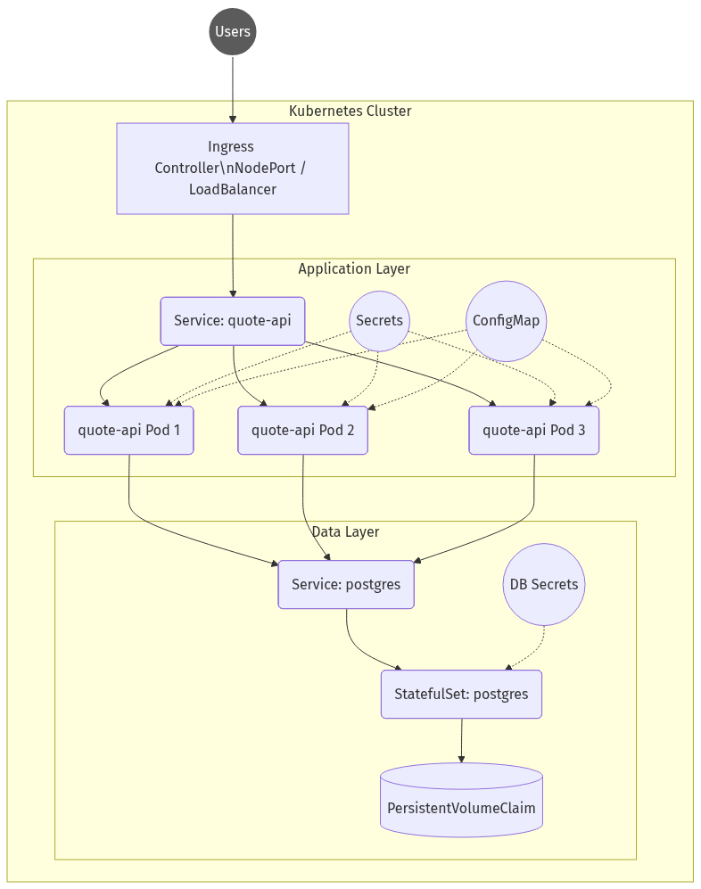

# Défi Final Systèmes (Final Systems Challenge)

## Problèmes du Système Actuel

### 1. Point de Défaillance Unique et Manque de Redondance
**Quel est le problème ?** L'application et la base de données fonctionnent dans le même Pod, et il n'y a qu'une seule instance de ce Pod déployée.
 
**Pourquoi est-ce important ?** Dans un système en production, les pannes matérielles et logicielles sont inévitables. Lier tous les composants dans un seul Pod signifie qu'ils partagent exactement le même sort.

**Quel risque opérationnel ou de panne cela pourrait-il causer ?** Si le Pod plante en raison d'un bug applicatif, ou si le nœud sous-jacent est arrêté pour maintenance, l'ensemble du système subit une interruption (downtime). Il n'y a aucune tolérance aux pannes et aucune capacité à gérer les pics de trafic via une mise à l'échelle horizontale.

### 2. Stockage Éphémère de la Base de Données
**Quel est le problème ?** PostgreSQL s'exécute dans le conteneur sans aucun stockage persistant configuré (PersistentVolumes/PersistentVolumeClaims).

**Pourquoi est-ce important ?** Les bases de données existent pour stocker des états de manière persistante. Les conteneurs, par conception, sont éphémères.

**Quel risque opérationnel ou de panne cela pourrait-il causer ?** Chaque fois que le Pod redémarre, plante ou est replanifié sur un nouveau nœud, toutes les données utilisateur stockées dans la base de données sont définitivement perdues. C'est un risque critique qui entraînerait une perte totale des données dans un environnement réel.

### 3. Absence de Vérifications d'État (Health Checks) et de Gestion des Ressources
**Quel est le problème ?** Il n'y a pas de sondes de vivacité (liveness) ou de préparation (readiness) configurées, ni de limites ou requêtes de ressources définies pour le conteneur.

**Pourquoi est-ce important ?** Kubernetes s'appuie sur ces sondes pour savoir quand redémarrer une application bloquée et quand il est sûr de lui envoyer du trafic. Les limites de ressources empêchent une seule application de monopoliser toutes les ressources du nœud.

**Quel risque opérationnel ou de panne cela pourrait-il causer ?** Sans sondes, une API bloquée continuera de recevoir du trafic mais ne parviendra pas à le traiter, entraînant une expérience utilisateur dégradée sans récupération automatique. Sans limites de ressources, une fuite de mémoire (memory leak) pourrait consommer toutes les ressources disponibles du nœud, risquant de faire planter l'ensemble du serveur sous-jacent (OOMKilled) ou d'affecter d'autres applications déployées.

### 4. Gestion Non Sécurisée des Secrets
**Quel est le problème ?** Les identifiants et secrets de la base de données sont passés sous forme de variables d'environnement en texte clair dans la configuration de déploiement.

**Pourquoi est-ce important ?** Les meilleures pratiques de sécurité exigent que les informations sensibles soient séparées du code de l'application et de la logique de configuration.

**Quel risque opérationnel ou de panne cela pourrait-il causer ?** Toute personne ayant un accès en lecture aux objets Deployment du cluster, ou un accès au dépôt de versionning où le code YAML est stocké, peut extraire instantanément les mots de passe de la base de données de production, entraînant une faille de sécurité majeure.

---

## Architecture de Production

Ci-dessous se trouve la conception de l'architecture prête pour la production. Elle dissocie l'application de la base de données, introduit la persistance des données et exploite les primitives Kubernetes conçues pour la haute disponibilité.

### Améliorations Clés :
- **Déploiement de l'Application :** La `quote-api` est déployée en tant que `Deployment` standard avec 3 réplicas configurés pour assurer une haute disponibilité.

- **Exposition du Service :** L'application est exposée en interne via un `Service` de type `ClusterIP`, qui est ensuite routé via un contrôleur `Ingress` pour gérer le trafic externe des utilisateurs de manière transparente.

- **StatefulSet de la Base de Données :** PostgreSQL est déployé en tant que `StatefulSet` attaché à un `PersistentVolumeClaim`. Cela garantit que le stockage de la base de données survit aux redémarrages et replanifications des pods.

- **Gestion des Secrets :** Les identifiants de la base de données sont déplacés vers un objet `Secret` Kubernetes, qui est injecté de manière sécurisée dans les pods nécessaires.

- **Stratégie de Déploiement Sécurisée :** Le `Deployment` de l'application est configuré avec une stratégie `RollingUpdate`, garantissant des déploiements sans interruption (zero-downtime) lors de la modification des images de conteneurs ou des configurations.

---

## Stratégie Opérationnelle

**Comment le système évolue-t-il (mise à l'échelle) ?**
L'application évolue horizontalement (scalabilité horizontale). En exécutant la `quote-api` en tant que `Deployment`, nous pouvons facilement augmenter le nombre de réplicas (ou attacher un `HorizontalPodAutoscaler` pour évoluer en fonction des métriques CPU/mémoire). Le `Service` backend équilibre automatiquement la charge du trafic entrant entre tous les pods sains de l'application.

**Comment les mises à jour sont-elles déployées en toute sécurité ?**
Les mises à jour sont gérées via la stratégie Kubernetes `RollingUpdate`. Lors d'un déploiement, Kubernetes démarre de nouveaux pods tout en terminant progressivement les anciens. Les sondes de préparation (readiness probes) s'assurent que le trafic n'est pas routé vers les nouveaux pods tant que leurs conteneurs ne sont pas complètement démarrés et signalent un état sain, maintenant ainsi une disponibilité de 100% pour les utilisateurs finaux.

**Comment les pannes sont-elles détectées ?**
Les pannes sont détectées grâce aux sondes `liveness` et `readiness` configurées.
- **Sondes Liveness :** Interrogent périodiquement un endpoint de santé (par ex., `/healthz`). Si une sonde échoue de manière répétée, le kubelet redémarre le conteneur pour récupérer des blocages (deadlocks).
- **Sondes Readiness :** Empêchent le Service de router le trafic vers un Pod qui démarre ou qui est temporairement incapable de traiter les requêtes.

**Quels contrôleurs Kubernetes gèrent la récupération ?**
- **ReplicaSet (via Deployment) :** Surveille en permanence la couche d'application. Si un pod applicatif plante, le ReplicaSet planifie immédiatement un remplacement pour maintenir le nombre souhaité de 3 réplicas.
- **Contrôleur StatefulSet :** Gère la base de données PostgreSQL. Si le pod de la BD échoue, le contrôleur StatefulSet le redémarre tout en garantissant que l'identifiant réseau unique et, de manière critique, le `PersistentVolume` restent correctement attachés, évitant ainsi la perte de données.

---

## Point Faible (Weakest Point)

**Quelle est la partie la plus faible de votre architecture et pourquoi ?**
Le point faible de cette conception de production actuelle est **l'instance unique de la base de données PostgreSQL**.

Bien que le déplacement de PostgreSQL vers un StatefulSet avec un PersistentVolumeClaim résolve le problème de la persistance des données lors des redémarrages, il s'agit toujours fondamentalement d'une base de données primaire unique. Sous charge de travail intense, ou dans le cas d'une panne catastrophique du nœud où réside le pod de la base de données, il y aura une interruption (downtime) pendant que Kubernetes attend que le volume se détache du nœud défaillant et se rattache à un nouveau pod sur un nœud sain.

De plus, si la base de données devient le goulot d'étranglement (bottleneck) avec un trafic multiplié par 10, elle ne peut pas être mise à l'échelle horizontalement de façon native comme l'API sans état (stateless). Pour résoudre ce véritable point de défaillance unique dans un système hautement critique, la base de données devrait être mise à niveau vers une configuration haute disponibilité primaire-réplica (à l'aide d'outils comme Patroni ou l'opérateur Zalando) ou externalisée vers un service de base de données en cloud entièrement géré (comme AWS RDS ou Google Cloud SQL) offrant une redondance multi-zones (multi-AZ).

---

## Réflexion Supplémentaire (Stretch Thinking)

**Qu'est-ce qui casserait en premier avec un trafic multiplié par 10 (10x traffic) ?**
C'est la **base de données PostgreSQL unique** qui céderait en premier. Comme mentionné dans la section précédente, l'API sans état (stateless) peut facilement être mise à l'échelle via l'ajout de nouveaux pods, mais la base de données deviendrait rapidement un goulot d'étranglement au niveau du CPU, de la mémoire ou des entrées/sorties (I/O) du disque, ce qui augmenterait drastiquement la latence et provoquerait des erreurs de connexion.

**Quels signaux de surveillance (monitoring signals) regarderiez-vous en premier ?**
Je surveillerais en priorité les **« Quatre Signaux d'Or » (Four Golden Signals)** :
1. **Latence** : Le temps de réponse de l'API.
2. **Trafic** : Le nombre de requêtes par seconde.
3. **Erreurs** : Le taux d'erreurs HTTP 5xx renvoyées par l'API.
4. **Saturation** : L'utilisation du CPU/Mémoire des pods, ainsi que le nombre de connexions actives et le temps d'exécution des requêtes sur la base de données.

**Comment déploieriez-vous ce système sur plusieurs nœuds ou régions ?**
- **Multi-nœuds (Multi-AZ) :** J'utiliserais des règles de **podAntiAffinity** dans Kubernetes pour m'assurer que les pods de l'application et de la base de données sont distribués sur des nœuds physiques et des zones de disponibilité (Availability Zones) distincts au sein du même cluster.
- **Multi-régions :** Je déploierais un cluster Kubernetes complet par région, couplé à un service d'équilibrage de charge mondial de type DNS pour diriger les utilisateurs vers la région la plus proche. La base de données utiliserait la réplication asynchrone inter-régions.

**Quelle partie de ce système pourrait nécessiter des machines virtuelles au lieu de conteneurs ?**
La **base de données (PostgreSQL)**. Bien qu'il soit possible de l'exécuter dans Kubernetes, de nombreuses architectures de production préfèrent exécuter les bases de données relationnelles principales directement sur des machines virtuelles (VM) dédiées ou utiliser des services cloud gérés (comme Amazon RDS ou Google Cloud SQL). Cela permet un réglage fin des performances du système d'exploitation, simplifie les sauvegardes à grande échelle et évite la complexité du routage du stockage persistant à travers les couches réseau et de stockage de Kubernetes.
